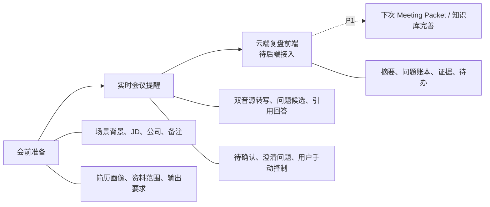

# Meeting Copilot V1 产品需求文档

状态：`V1.0 — P0 功能基线已确认`  
版本：1.0  
日期：2026-08-06  
产品形态：macOS 14+ 本地优先桌面客户端

## 1. 一页结论

### 最有价值的定位

Meeting Copilot 是面向个人用户的**本地优先会议沟通副驾**：用户在会前输入背景并授权资料范围；客户端在会议中输出可引用、可编辑、不可自动发送的提醒；会后将真实会话沉淀为可验证的复盘与练习资料。

### 首期聚焦

- 面试会议：技术面、项目经历面、综合面。
- 售前商务会议：方案交流、技术澄清、需求访谈。

技术会议、普通会议和自定义场景复用统一底座，以模板和 Skill 扩展，不在首期维护多套独立链路。

### 关键问题

1. 当前会议登记和知识库并未保存完整的会前上下文、简历画像、会话时间线或复盘实体。
2. 音频“已连接”不能证明已收帧或已转写；真实双音源、ASR 与 3 秒目标必须端到端验证。
3. 会议建议需要资料范围隔离、引用、待确认标记，避免把模型推断包装成客户或候选人事实。
4. 不受控的 Agent 工具循环不适合实时路径；需要固定、可观测的工作流。
5. 深度复盘必须以真实转写和证据为基础，不能做无依据的人格、情绪、诚信判断。

### 优先投入

1. Meeting Packet + 简历画像确认 + 本次资料范围。
2. 实时会议提醒闭环：音频健康、转写、候选问题、引用回答、手动控制。
3. 云端复盘前端：先验证摘要、问题账本、证据、待办和练习的信息架构；真实云端复盘后端后置 P1。
4. 端到端 Trace、错误/成本可观测性与隐私控制。

## 2. 产品目标与非目标

### 目标

- 一次会前配置形成可复用的 `Meeting Packet`。
- 在明确授权下区分“本机麦克风本人”和“系统音频其他参会者”，提供实时转写和问题候选。
- 基于当前会议语境、Meeting Packet 和授权资料流式输出“可说、可证、可确认”的建议。
- 本地保留用户可控制的会话档案，并提供云端复盘前端入口；初期不生成或上传复盘报告。

### 非目标

- 不承诺远端多人真实姓名识别；首期只区分本人和匿名远端片段。
- 不自动发言、朗读、发送消息、修改外部系统、报价或作出承诺。
- 不实现隐蔽录音、平台规避、考试作弊、虚假身份。
- 不建设账号体系、团队协作、云同步、统一计费或托管模型代理。
- 不在本地部署或推理 ASR、向量、重排、LLM。
- 不输出“面试官人格/情绪/诚信”之类主观事实。

## 3. 目标用户与核心任务

| 用户 | 核心任务 | 首期价值 |
|---|---|---|
| 解决方案经理/售前 | 快速组织价值、方案边界和下一步 | 用已授权方案资料生成可直接表达的回答与澄清问题 |
| 技术方案/产品/交付 | 回应技术细节、取舍、风险 | 输出技术回答骨架、风险和验证项 |
| 求职者 | 将 JD、简历、项目细节连接为结构化表达 | 用经确认的简历画像输出 STAR/技术面回答 |
| 复盘使用者 | 从零散记忆变成可行动改进 | 形成问题账本、资料缺口、待办和练习问题 |

## 4. 业务架构



| 阶段 | 用户输入 | 系统产出 | 控制边界 |
|---|---|---|---|
| 会前 | 场景/主题/背景、JD、公司、备注、简历、资料范围、表达要求 | Meeting Packet 与会前检查 | 简历画像需人工确认；资料范围显式选择 |
| 会中 | 授权、采集控制、手动提问/确认 | 转写、候选问题、中央回答、引用、待确认 | 不自动发送或发言；随时暂停/结束 |
| 会后 | 查看复盘信息架构、导出或删除 | 云端复盘待接入提示、预期报告结构 | 当前无后端、无上传；仅 Markdown 导出 |

## 5. 统一能力与场景模板

| 能力 | 统一底座 | 面试会议模板 | 售前商务会议模板 | 后续技术/自定义模板 |
|---|---|---|---|---|
| 音频、转写、问题候选 | 是 | 识别能力/项目/行为问题 | 识别需求、异议、技术澄清 | 识别方案、风险、决策 |
| Meeting Packet | 是 | JD、简历、岗位/公司 | 客户背景、方案范围、承诺边界 | 角色、目标、材料范围 |
| 检索与证据门控 | 是 | 简历、项目、技术材料 | 方案、案例、白皮书 | 设计、纪要、规范 |
| 回答 Skill | 否 | STAR、技术取舍、项目细节 | 价值、方案、边界、下一步 | 决策、风险、行动项 |
| 复盘前端 | 是 | 复盘报告信息架构 | 商机关注点与行动信息架构 | 决策记录、未决项 |

## 6. 功能范围

| 模块 | P0：首期必须 | P1：增强 | P2：探索 |
|---|---|---|---|
| Meeting Packet | 场景背景、JD、公司、备注、简历、会议要求、资料范围 | 角色、目标、禁答边界、可复用模板 | 团队模板 |
| 简历 | Word、文本 PDF、图片上传；结构化画像；人工确认 | 扫描 PDF 逐页 OCR、JD 匹配 | 多版本简历管理 |
| 实时提醒 | 音频健康、转写、候选问题、手动提问、中央建议卡、引用/待确认、流式输出 | 快捷键、追问、双语、术语表 | 多远端说话人聚类 |
| 回答控制 | 15/30/60/90 秒、STAR、技术方案、售前方案、简洁直答 | Skill 版本管理 | 模拟面试、追问树、题库 |
| 云端复盘 | 复盘前端页、待接入/空态、Markdown 导出入口状态、删除入口 | 授权、后端任务、真实摘要/账本/证据/待办和导出 | 个人成长画像 |
| 知识库 | 本次范围选择、引用定位、资料不足提示 | 标签、有效期、敏感等级、冲突提示 | 团队授权治理 |
| 可观测性 | 状态、耗时、错误、估算用量 | 单会话 Trace、趋势、诊断包 | 组织级成本治理 |

## 7. P0 功能需求与验收

### FR-01 Meeting Packet

**字段**：场景/主题/背景（主输入）、JD（面试必填）、公司或客户名称、备注、个人简历、会议要求（语言/时长/语气/格式/附加要求）、资料范围、模板、Skill 版本。

**验收标准**：

- 可新建、保存、复制、编辑、选择 Packet；会中 `Session` 记录关联 `packetId` 与冻结版本。
- 简历解析后的经历、项目、技能、成果、待核实项可预览、编辑、确认；未确认内容不得作为事实进入回答。
- P0 不要求简历原件或画像默认脱敏，也不新增“必须加密保存”的产品要求；用户可查看来源并删除其简历与画像。
- 所选资料以外的文档不得进入本轮检索。
- 公司名称只有上下文标签作用；无资料来源时，不能生成其业务/技术栈/现状的确定性陈述。

### FR-02 实时会议提醒

**连续状态**：权限检查 → 音频帧已接收 → ASR 连接中 → 正在转写 → 发现疑似问题 → 正在检索 → 正在组织建议 → 已完成/降级。

**中央建议卡**：对方问题、问题意图、建议先说、15/30/60/90 秒版本、回答骨架、引用、待确认、建议澄清问题。

**验收标准**：

- 麦克风与系统音频分别显示实际帧数、采样率、ASR 字符数和错误；不能用“连接成功”表示有效转写。
- 自动候选只进行预检索；用户可确认、忽略、手动输入或快捷键触发。
- 无资料命中时，显示“资料不足/建议澄清”，不编造答案。
- 每条建议显示“有资料依据”“待确认”或“降级生成”状态。
- 以“问题结束至首个可读建议 P95 ≤ 3 秒”为试用门槛；压测前仅是工程目标。
- 支持暂停、继续、复制、重试、标记待复盘、结束会话；不自动输出到外部系统。

### FR-03 云端复盘前端界面（P0 不接后端）

**界面范围**：复盘概览、问题账本、回答与证据、对方关注点、行动项与练习的页签、空态、待接入态、删除入口和 Markdown 导出入口状态。该信息架构用于验证用户路径，不能表示报告已经生成。

**验收标准**：

- 复盘模块可从单场会议进入；无会话、无网、服务待接入均有可操作说明。
- 初期不创建 `ReviewReport`、不调用云端复盘模型、不上传转写/引用/知识库材料；Trace 中不能出现复盘云端请求。
- 页面不展示伪造的评分、结论、生成耗时或数据更新时间；任何样例仅能标注为“示例布局”。
- 用户仍可执行单场删除、全量清除和 Markdown 导出；导出内容仅限当前已真实保留的本地文本，不生成复盘报告。
- “对方关注点”仅作为未来 P1 的基于问题主题的证据化归纳；不使用无依据的“面试官剖析”，也不做人格、情绪、诚信判断。

### FR-04 可观测性与数据控制

**验收标准**：

- 每轮链路记录 `traceId → sessionId → turnId → spanId`，含音频帧、ASR、检索、重排、首字、完成、错误和估算用量。
- 日志不记录 API Key、完整提示词、完整转写、原始音频、资料正文。
- 用户可查看当前会话的数据保留状态、导出前提示和删除结果。

## 8. 关键用户流程

### 流程 1：创建并配置会议场景

| 责任方 | 行为 |
|---|---|
| 用户操作 | 选择模板，填写场景背景/JD/公司/备注，上传简历，选择资料范围和表达要求 |
| 本地客户端 | 保存草稿，解析可本地提取的文本，记录文件来源和 Packet 版本 |
| 云端 AI | 仅在需要时对 OCR 页面或文本生成简历画像；输出结构化 JSON |
| 隐私提示 | 显示会发送的最小数据、保存位置、删除入口 |
| 异常降级 | 解析失败可重试/手工录入；未确认简历不进入上下文 |

### 流程 2：进入会议并开启实时辅助

| 责任方 | 行为 |
|---|---|
| 用户操作 | 选择 Packet，确认授权，开始/暂停/结束采集 |
| 本地客户端 | 检查屏幕录制与麦克风权限，显示双音源健康，创建加密 Session |
| 云端 AI | ASR 接收 16kHz 分片并回传增量/最终转写 |
| 隐私提示 | 明确“原始音频默认不保存”和云端 ASR 必要处理 |
| 异常降级 | 某一音源失败时显示仅单音源；ASR 失败仍允许手动输入问题 |

### 流程 3：区分发言者并生成建议

| 责任方 | 行为 |
|---|---|
| 用户操作 | 确认疑似问题或手动触发，选择时长/重答/复制 |
| 本地客户端 | 麦克风标记本人，系统音频标记匿名远端；合并最终轮次并持久化 |
| 云端 AI | 受控检索、重排、单次流式生成；无证据转为澄清建议 |
| 隐私提示 | 所有资料型表述都应提供引用或待确认标记 |
| 异常降级 | 向量失败用 FTS-only；重排失败用本地候选；生成超时保留已输出内容 |

### 流程 4：查看、编辑与使用建议

| 责任方 | 行为 |
|---|---|
| 用户操作 | 阅读中央“建议先说”、展开引用、编辑/复制、不使用或标记待复盘 |
| 本地客户端 | 显示 Skill、Packet、引用与不确定性；不代替用户行动 |
| 云端 AI | 无新增外部行动 |
| 隐私提示 | 复制仅进入系统剪贴板；客户端不自动发送 |
| 异常降级 | 无引用或资料不足时锁定为澄清建议，不显示为事实答案 |

### 流程 5：会后归档与云端复盘前端

| 责任方 | 行为 |
|---|---|
| 用户操作 | 查看复盘报告结构、删除本场或导出本地记录 |
| 本地客户端 | 显示“云端复盘待接入”，提供各页签说明、Markdown 导出和删除联动 |
| 云端 AI | P0 不调用云端复盘服务，也不接收会话文本 |
| 隐私提示 | 明确“当前页面不上传转写”；P1 启用真实复盘前必须另行进行授权与数据范围确认 |
| 异常降级 | 无网与未接入均显示同一明确待接入态，不伪造报告或重试任务 |

## 9. UX 原型（低保真）

### 会前：新建会议（Meeting Packet）

```text
┌──────────────────────────────────────────────────────────────────┐
│ 会议模板 [面试会议] [售前商务会议]                                  │
├───────────────────────────┬──────────────────────────────────────┤
│ 场景、主题、背景（主输入）  │ 本次资料范围  ☑ 简历 ☑ 方案 ☐ 历史纪要 │
│ 岗位 JD（面试必填）         │ 已解析简历： [查看来源][编辑确认][重解析] │
│ 公司/客户名称               │ 输出：中文 / 60 秒 / STAR 或方案回答      │
│ 备注                         │ 其他会议要求                              │
├───────────────────────────┴──────────────────────────────────────┤
│ 信息完整度 8/10；待确认：简历画像、资料范围  [保存] [进入会前检查]  │
└──────────────────────────────────────────────────────────────────┘
```

### 会中：中央回答优先

```text
┌────────────────────┬──────────────────────────────┬──────────────┐
│ 实时语境            │            AI 回答建议        │ 本次控制台    │
│ 远端 A：问题转写     │ 对方问题 / 意图                │ 回答风格      │
│ 本人：我的表达       │ 建议先说（15 秒）               │ 当前 Packet   │
│ 麦克风、系统音频、ASR │ 回答骨架 / 流式完整答案          │ 手动提问      │
│ 健康状态             │ [15秒][60秒][精简][重答][复制]  │ 暂停/结束     │
│                      │ 资料依据、待确认、下一步问题     │              │
└────────────────────┴──────────────────────────────┴──────────────┘
```

### 会后：云端复盘（前端待接入）

```text
┌──────────────────────────────────────────────────────────────────┐
│ [会议摘要] [问题账本] [回答与证据] [对方关注点] [行动项与练习]      │
├────────────────────────────────┬─────────────────────────────────┤
│ 云端复盘服务待接入                 │ 当前不会上传转写或生成报告             │
│ 后续将展示问题、证据、待办、练习   │ [导出本地 Markdown] [删除本场]         │
└────────────────────────────────┴─────────────────────────────────┘
```

## 10. 非功能需求、隐私与成本

| 维度 | 要求 |
|---|---|
| 时延 | P95 首字 ≤ 3 秒是压测门槛，不是未经验证的承诺 |
| 隐私 | 每次采集前确认；原始音频默认不保存；云端仅最小必要数据；P0 复盘页不上传会话文本 |
| 安全 | Keychain 仅由 Rust Provider Facade 读取；前端和日志不能读到明文密钥 |
| 可信 | 资料型回答必须有引用或待确认；材料内指令均作为不可信内容 |
| 稳定 | 明确展示权限、无帧、ASR、检索、重排、生成、数据库的状态与降级 |
| 成本 | 记录音频秒数、Embedding/Rerank 请求、输入/输出估算；支持模型和会话上限 |
| 合规 | 地区法律、公司制度、会议平台政策和供应商数据地域均为上线前待验证项 |

## 11. 成功指标

| 指标 | 口径 |
|---|---|
| 实时首字 | 问题结束至首个可读建议 P95 ≤ 3 秒（目标网络/模型/测试集） |
| 有效音频 | UI 和 Trace 都可核验双音源帧数、采样率、ASR 字符数 |
| 可信建议 | 所有资料型表达具“引用”或“待确认”状态 |
| 复盘前端诚实性 | 未接后端时明确展示待接入，无伪造报告、评分或云端请求 |
| 用户控制 | 可暂停、手动触发、删除、导出、关闭会话保存 |
| 成本可见 | 每场的模型操作、时延、错误、估算用量可查询 |

## 12. 已确认范围与后续确认

见 [开发计划](./meeting-copilot-v1-development-plan.md) 的“已确认的 P0 范围”。P1 启动云端复盘后端前，仍需单独确认用户授权、数据上传范围、成本上限、证据门控和合规要求；当前 V1.0 不把这些能力描述为已实现。
