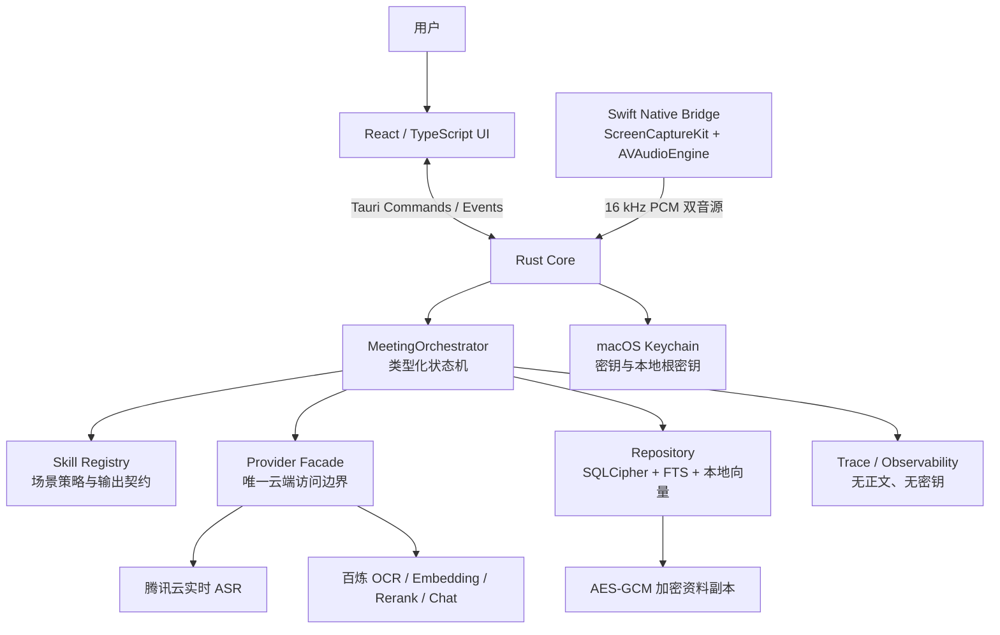
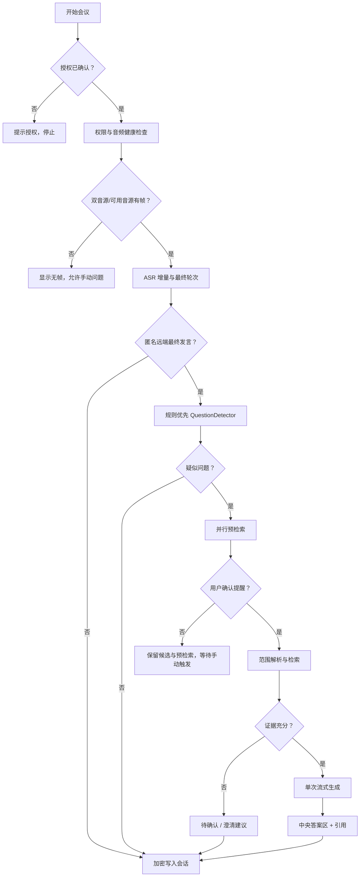
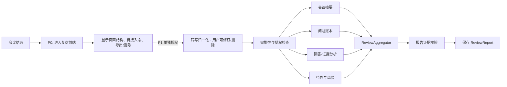

# Meeting Copilot V1 技术与智能体编排设计

状态：`V1.0 — P0 功能基线已确认`  
日期：2026-08-06

## 1. ADR-001：智能体框架选型

**决策**：V1 在现有 Tauri/Rust Core 中实现 `MeetingOrchestrator`（类型化状态机 + 固定工具链 + Tokio 异步任务）。实时路径不引入 LangChain、LangGraph、CrewAI、AutoGen 等框架运行时。

| 方案 | 适配性 | 结论 |
|---|---|---|
| Rust 受控状态机 | 适合单用户、本地 Mac、BYO Key、低时延和 Keychain 隔离 | V1 采用 |
| LangGraph | 长任务、持久化、人机协同、状态图较强 | V2+ 异步复盘候选 |
| LangChain | Agent/工具抽象丰富 | 当前 Rust 主链无需依赖 |
| ReAct | 推理模式，不是框架 | 会后受控补充检索，最多两轮 |
| CrewAI/AutoGen | 多 Agent 对话自主性高 | 不建议，时延和成本不可控 |

实时链路每题的预算上限：一次 Embedding、一次本地召回、一次 Rerank、一次流式 Chat；模型不得自行选择工具或循环调用。

## 2. 技术架构



### 职责边界

| 位置 | 职责 | 禁止事项 |
|---|---|---|
| React UI | 输入、呈现、控制、展开引用 | 读取/缓存 API Key、直接调用模型 |
| Swift Bridge | 权限、系统音频、麦克风、设备状态 | 模型推理、保存原始音频 |
| Rust Core | 编排、加密存储、Provider 调用、状态、审计 | 任意 shell、浏览器、外部发送 |
| Provider Facade | 从 Keychain 读取配置，最小必要云端调用 | 将密钥返给 UI，任意跨供应商切换 |
| 云模型 | ASR/OCR/向量/重排/生成 | 保存原始知识库文件作为默认行为 |

## 3. 受控 MeetingOrchestrator

### 会话和轮次状态

```text
SessionState: Draft → PermissionCheck → Connecting → Capturing ⇄ Paused
              → Stopping → Ended
              ↘ Degraded / Failed

TurnState: Partial → Finalized → QuestionCandidate → Prefetching
           → AwaitingUser / Generating → Completed / Failed
```

会话状态负责采集和授权；轮次状态负责单次语义/回答。转写失败不会隐式结束整个会话。

### 实时工作流



### 节点与降级

| 节点 | 类型 | 失败处理 |
|---|---|---|
| AudioHealthGate | 确定性 | 显示权限、设备、帧数、采样率；不伪造成功 |
| TurnAssembler | 确定性 | 保留增量；仅最终 ASR 可触发回答 |
| QuestionDetector | 规则优先 | 不确定则等待用户手动触发 |
| ScopeResolver | 确定性 | 无范围时只使用用户本轮输入 |
| retrieve_evidence | 受控工具 | Embedding 失败切 FTS-only（待建设）；Rerank 失败用本地候选 |
| EvidenceGate | 确定性 | 无证据只输出待确认/澄清，不编造 |
| compose_answer | 单次云端调用 | 保存已流式内容，支持重试 |
| persist_artifacts | 确定性 | 显示未保存，不显示已归档 |

## 4. 产品内 Skills

这里的 Skill 是版本化场景策略包，不是 Codex Skill、外部插件或可执行脚本。

```yaml
id: presales.solution.v1
version: 1.0.0
scope: business
allowed_tools: [retrieve_evidence, compose_answer, persist_artifacts]
trigger: { workspace_kind: business }
output_contract: [conclusion, customer_value, solution, pending_confirmation, next_question]
policies:
  evidence_required: true
  unsupported_fact: pending_confirmation
  auto_send: false
  external_browsing: false
limits: { max_citations: 6, max_rerank_candidates: 12, max_tool_rounds: 1 }
```

| Skill | 场景 | 输出契约 |
|---|---|---|
| `interview.star.v1` | 通用面试 | 结论、S/T/A/R、待确认 |
| `interview.tech.v1` | 技术面/系统设计 | 澄清、方案、取舍、风险、验证 |
| `presales.solution.v1` | 售前/商机 | 价值、方案、边界、待确认、下一步 |
| `meeting.action.v1` | P1 技术/普通会议 | 结论、决策、待办、责任、风险 |
| `review.interview.v1` | P1 面试复盘 | 账本、证据覆盖、练习建议 |
| `review.business.v1` | P1 商务复盘 | 客户关切、承诺边界、机会、行动项 |

用户“其他会议要求”只能覆盖语言、长度、语气、格式等白名单字段，不能放宽证据边界、扩展资料范围、开启外部访问或自动发送。

## 5. 云端复盘：P0 前端与 P1 后端边界



P0 不实现图中 P1 虚线后的任何节点，不调用云端模型，也不上传转写、引用或资料。P1 复盘任务应是有限并行图，而不是多个 Agent 自由聊天；每项结论要么关联转写或资料，要么标为模型建议。

## 6. 新增数据模型

| 实体 | 关键字段 |
|---|---|
| `MeetingPacket` | `scenarioContext`、`jobDescription`、`companyName`、`notes`、`outputRequirements`、`skillId/version`、`knowledgeScope`、`resumeProfileId` |
| `ResumeProfile` | `sourceDocumentId`、结构化经历/技能/项目/引用、`confirmedAt` |
| `MeetingSession` | `packetSnapshot`、授权记录、起止时间、状态、数据保留策略 |
| `TranscriptTurn` | `sessionId`、音源、匿名说话人、最终文本、时间戳 |
| `QuestionCandidate` | `turnId`、意图、触发方式、用户确认状态 |
| `Suggestion` | 问题、回答、Skill/Packet 版本、引用、首字耗时、状态 |
| `ReviewReport`（P1） | 摘要、账本、风险、待办、版本、生成状态 |
| `TraceSpan` | `traceId`、`sessionId`、`turnId`、操作、耗时、状态、错误码 |

新增 Commands：

```text
save_meeting_packet, parse_resume, confirm_resume_profile,
create_meeting_session, start_meeting_session, pause_meeting_session,
end_meeting_session, generate_reminder, mark_for_review,
get_session_detail, export_session,
delete_session, clear_all_history
```

P0 事件契约：`session-state`、`transcript-stream`、`reminder-stream`、`trace-updated`。`review-progress` 与 `review-ready` 是 P1 云端复盘后端事件。所有事件必须带 `sessionId`、`turnId` 或 `traceId`，不能靠自由文本反解析状态。

## 7. 安全、隐私、成本与可观测性

### 安全与隐私

- Keychain 仅由 Rust Provider Facade 读取；UI 只得到“已配置”状态。
- 原始音频默认只在内存传输到 ASR；任何未来短时加密缓存都需要显式确认。
- 转写、建议按既有本地安全存储策略处理；支持单场/全量删除和 Markdown 导出前二次确认。P0 不产生复盘报告。
- 简历不新增产品级“必须加密保存”或默认脱敏展示要求；但未确认画像不得进入生成，用户可删除原件与画像。
- 文档、JD、备注、简历和转写均是不可信内容，不能改变系统权限或资料范围。

### Trace 设计

```text
traceId → sessionId → turnId → spanId
```

每轮记录双音源首帧/帧数/空帧、ASR 连接/首字/最终字/错误、候选理由（不存正文）、检索/重排/生成耗时、证据门控和估算用量。禁止记录密钥、完整提示词、完整转写、原始音频和资料正文。

### 性能预算（待压测）

| 环节 | 目标预算 |
|---|---:|
| ASR 最终片段稳定 | ≤ 400 ms |
| 检测与范围解析 | ≤ 50 ms |
| 向量与本地召回 | ≤ 600 ms |
| 重排 | ≤ 500 ms |
| LLM 首字 | ≤ 1,800 ms |
| 前端渲染 | ≤ 100 ms |
| 合计 | P95 ≤ 3,000 ms |

此表是工程预算，不是上线性能承诺；需以真实设备、目标网络、指定模型和测试集验收。
